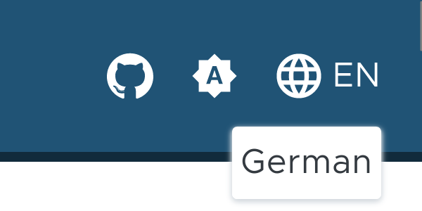
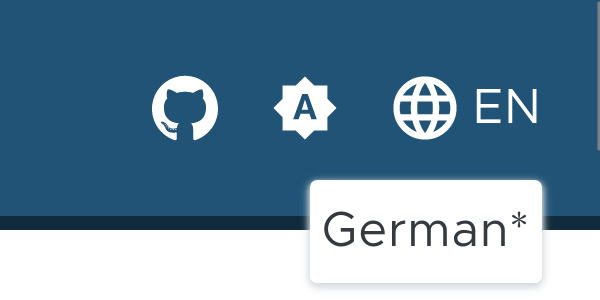



Hugo supports the creation of websites with multiple languages. In this post we will explain how to get configure Multilingual Mode with this theme.

## Configuration

### Languages

You need to set a default language and configure at least two different languages used by your site to your configuration file at `config.toml`:

```Toml
defaultContentLanguage = "en"

[languages.en]
languageName = "English"
contentDir = "content/en"
weight = 10

[languages.de]
languageName = "German"
contentDir = "content/de"
weight = 20
```

### Translation Strings

To customize translation strings used by the theme you can create a file `i18n/<languagecode>.toml` for every language you want to use e.g. `i18n/en.toml`. You can lookup all used strings in the [default](https://github.com/thegeeklab/hugo-geekdoc/blob/main/i18n/en.yaml) translation file.

### Menus

For the [Bundle Menu](/usage/menus/#bundle-menu) as well as for the [Extra Header Menu](/usage/menus/#extra-header-menu) you can translate the name within the data file of the menu:

```YAML
---
more:
  # If `name` is a text, this text will be used as name for each language.
  - name: News
    ref: "/#"
    icon: "gdoc_notification"
  # To translate the name you can add a sub-item per language. Important: If you miss a language key
  # that is configured in the languages list of your `config.toml` the name will be empty for this language!
  - name:
      en: Releases
      de: Veröffentlichung
    ref: "https://github.com/thegeeklab/hugo-geekdoc/releases"
    external: true
    icon: "gdoc_download"
```

## Add Content

To translate your content you need to create a directory `content/<languagecode>/` for each language you want to use e.g. `content/en/`. This language directories will hold the translated pages for the particular language.

## Switch Content

If you have configured at least two different languages, the language switcher will be enabled in the UI automatically. The switcher is as part of the header menu and displayed on all pages.



[](images/translation-available.png)

On pages for which a translation is available it will be displayed in the selection list and links to the translated page.

<--->

[](images/translation-not-available.png)

Pages without a translation will be displayed in the selection list as well but are marked with an asterisk and link to the start page of the respective language.


