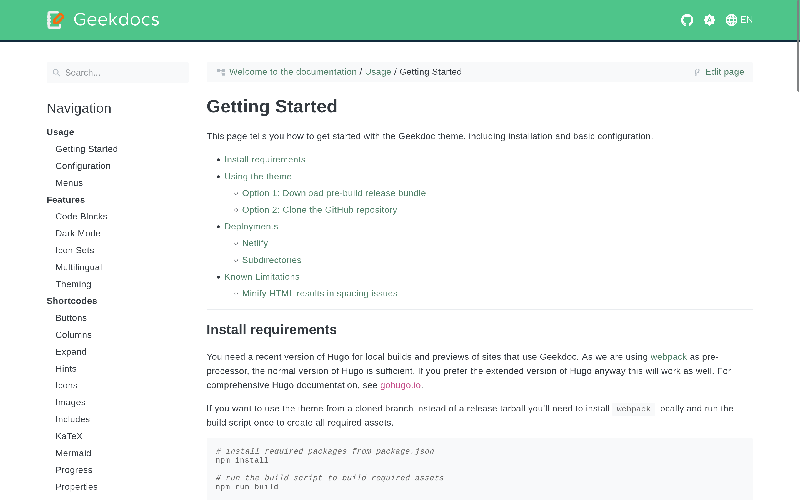



## Color Scheme

If you want to customize the theme's color scheme to give it your individual touch, you are only a few lines of CSS away. Generally, you need to override the default settings. The easiest way to do this is to create a file named `static/custom.css` right at the root of your site.

All the necessary CSS customization properties are listed below. If you want to customize elements that don't use these properties, you can always look up the class name and override it directly. For inspiration, you can also take a look at [https://www.color-hex.com](https://www.color-hex.com/color-palettes/). In this simple example, we'll use the [_Beach_](https://www.color-hex.com/color-palette/895) color palette.

[](images/theme-example.png)

**Custom CSS:**

<!-- prettier-ignore-start -->
<!-- spellchecker-disable -->

<!-- spellchecker-enable -->
<!-- prettier-ignore-end -->

## Favicons

The Theme is shipped with a set of default Favicons in various formats generated by the [Favicon Generator](https://realfavicongenerator.net/). All files can be found in the `static/favicon` folder of the release tarball. To make the replacement of the default Favicons as simple as possible, the theme loads only a very small subset of the Favicon formats.

<!-- prettier-ignore -->
```tpl
<link rel="icon" type="image/svg+xml" href="{{ "favicon/favicon.svg" | relURL }}">
<link rel="icon" type="image/png" sizes="32x32" href="{{ "favicon/favicon-32x32.png" | relURL }}">
<link rel="icon" type="image/png" sizes="16x16" href="{{ "favicon/favicon-16x16.png" | relURL }}">
```

### Simple replacement

The minimal steps to load a custom Favicon is to overwrite the three default Favicon files. Therefor place these files into your projects root folder:

- `static/favicon/favicon.svg`
- `static/favicon/favicon-32x32.png`
- `static/favicon/favicon-16x16.png`

### Full replacement

If you want to add more Favicon formats you have to [overwrite](https://gohugo.io/templates/partials/#partial-template-lookup-order) the default partial that is used to load the files. In the next step you have to place the required files in the `static` folder of your project as well.

**Example:**

<!-- prettier-ignore -->
```tpl
<!-- layouts/partials/head/favicons.html -->
<link rel="icon" type="image/svg+xml" href="{{ "favicon/favicon.svg" | relURL }}">
<link rel="apple-touch-icon" sizes="180x180" href="{{ "favicon/apple-touch-icon.png" | relURL }}">
<link rel="icon" type="image/png" sizes="32x32" href="{{ "favicon/favicon-32x32.png" | relURL }}">
<link rel="icon" type="image/png" sizes="16x16" href="{{ "favicon/favicon-16x16.png" | relURL }}">
<link rel="manifest" href="{{ "favicon/site.webmanifest" | relURL }}">
<link rel="mask-icon" href="{{ "favicon/safari-pinned-tab.svg" | relURL }}" color="#efefef">
<meta name="msapplication-TileColor" content="#efefef">
<meta name="theme-color" content="#efefef">
```

Happy customizing!
