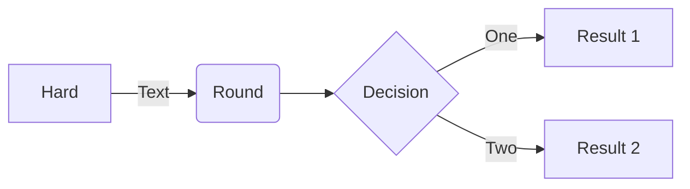

[Mermaid](https://mermaidjs.github.io/) is library for generating SVG charts and diagrams from text.

## Example

<!-- prettier-ignore -->
```tpl

sequenceDiagram
    Alice->>Bob: Hello Bob, how are you?
    alt is sick
        Bob->>Alice: Not so good :(
    else is well
        Bob->>Alice: Feeling fresh like a daisy
    end
    opt Extra response
        Bob->>Alice: Thanks for asking
    end

```

<!-- spellchecker-disable -->
<!-- prettier-ignore -->

sequenceDiagram
    Alice->>Bob: Hello Bob, how are you?
    alt is sick
        Bob->>Alice: Not so good :(
    else is well
        Bob->>Alice: Feeling fresh like a daisy
    end
    opt Extra response
        Bob->>Alice: Thanks for asking
    end


<!-- spellchecker-enable -->

As an alternative to shortcodes, code blocks can be used for markdown as well.



<!-- prettier-ignore -->
````tpl

````

<--->

<!-- spellchecker-disable -->
<!-- prettier-ignore -->


<!-- spellchecker-enable -->


