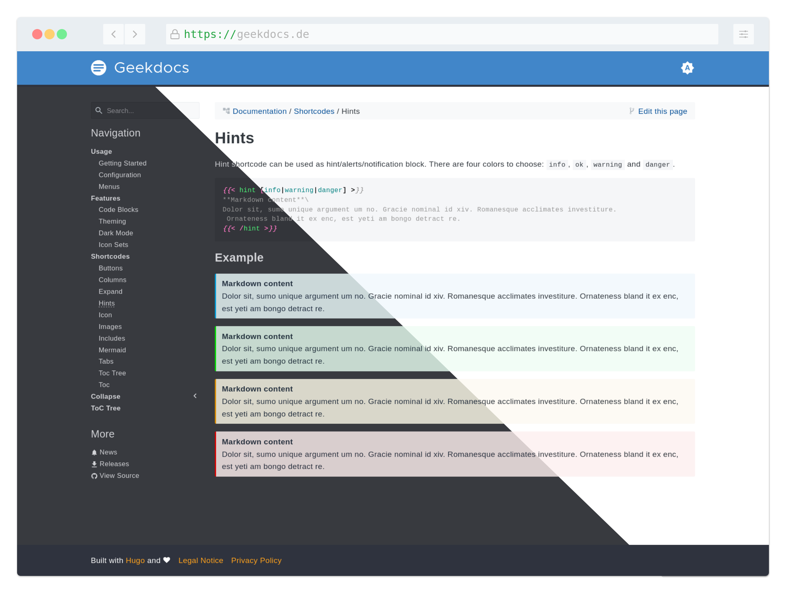

Say hello to the dark mode of the Geekdoc theme!

The dark mode can be used in two different ways. If you have JavaScript disabled in your browser, the dark mode still automatically detects the preferred system settings via the `prefers-color-scheme` parameter. Depending on the value, the theme will automatically switch between dark and light mode if this feature is supported by your operating system and browser.

The second mode requires JavaScript and is controlled by a dark mode switch in the upper right corner. You can switch between three modes: Auto, Dark and Light. Auto mode works the same as the first method mentioned above and automatically detects the system setting. Dark and Light modes allow you to force one of them for your Geekdoc page only, regardless of the system setting. This works even if your browser or operating system does not support the system setting. The current selection is stored locally via the Web Storage API.
